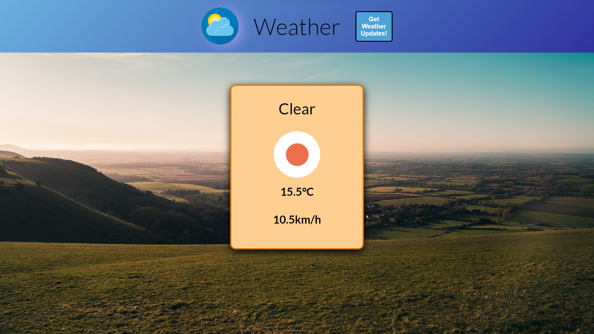
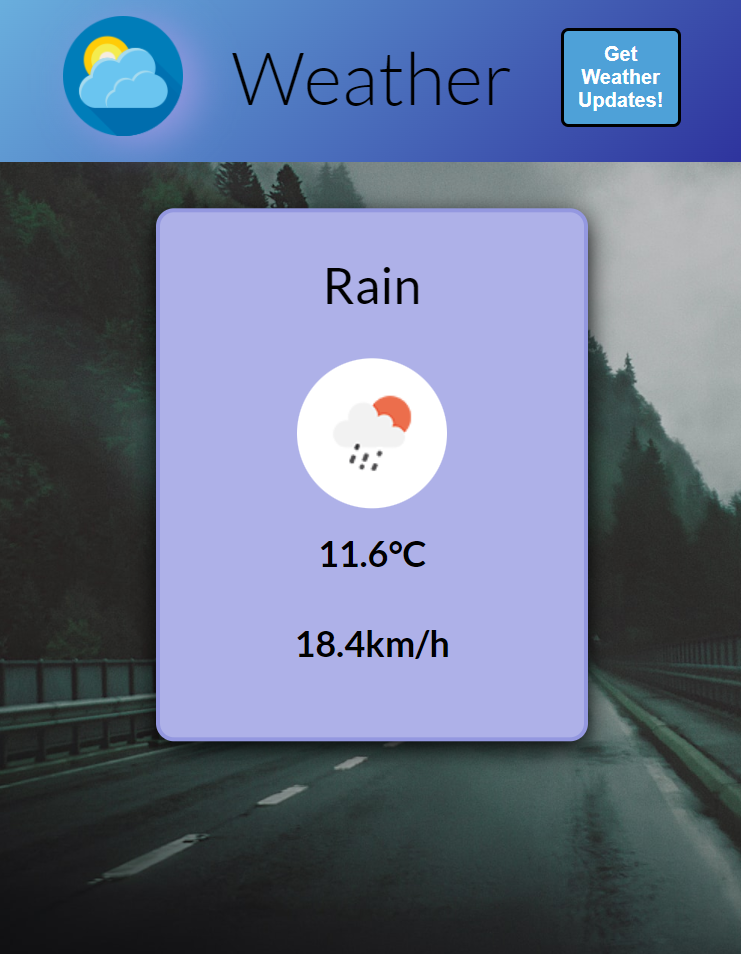

# Weather JS

## Screenshots

</img>
</img>

## Description

A JavaScript application based on the Odin Project exercise - **'Weather App'**

**Features:**

- Modern User Interface
- Simple Design
- Local Forecast Updates
- Background Images

## What I've Learnt

- Working with APIs
- Error handling

## Installation

To use this project, first clone the repo on your device using the command below:

`git init`

`https://github.com/tarwat-uddin/weather-js.git`

## License

[GNU General Public License version 3](https://opensource.org/licenses/GPL-3.0)
